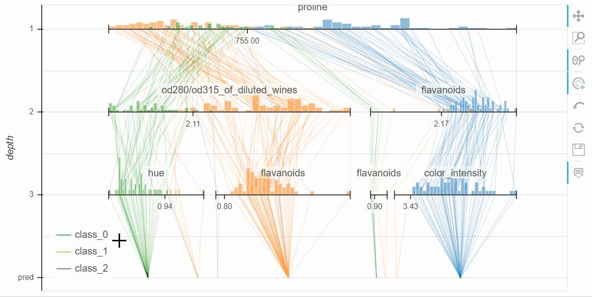
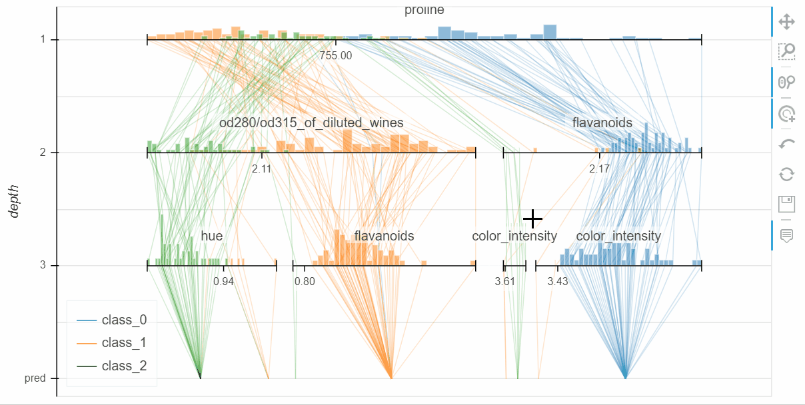
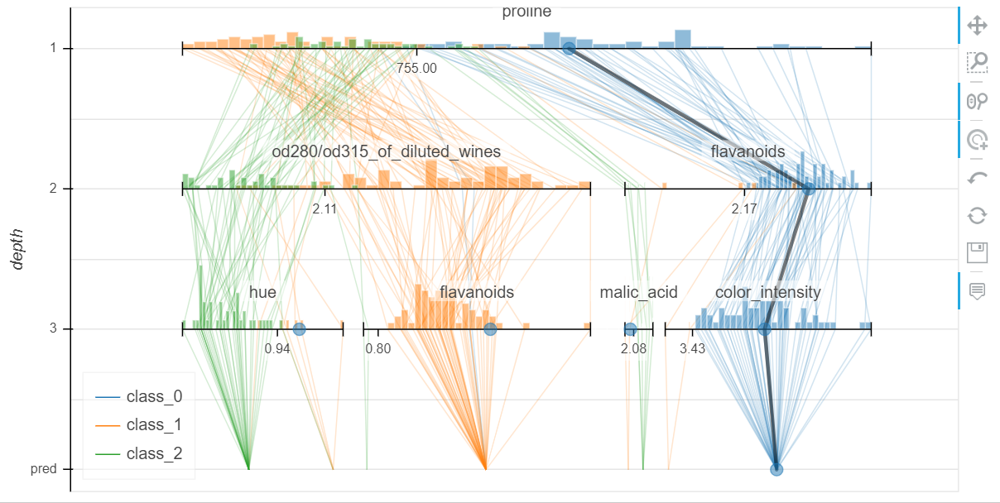
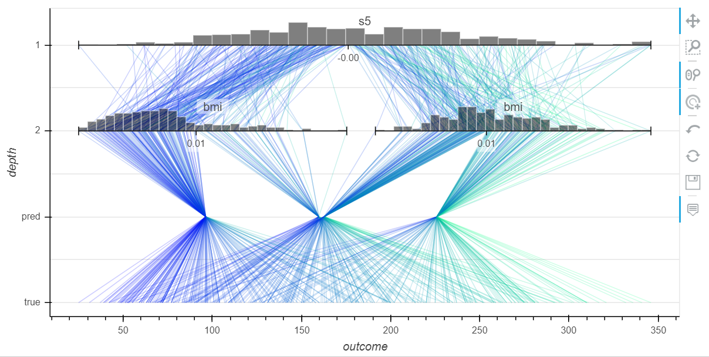

# Interactive parallel coordinates

Python code for interactive parallel coordinates visualization on jupyter notebook.

iparacoord (**i**nteractive **para**llel **coord**inates) has the following features:
* Interactive visualization of decision trees


## Requirement

* Python 3.6+
* numpy 1.16+
* pandas 0.24+
* scikit-learn 0.21+
* matplotlib 3.1+
* bokeh 1.2+
* jupyter notebook 6.0+

## Usage

Import modules:
```python
import iparacoord
from sklearn import datasets, tree
```

Visualize a decision tree classifier:
```python
wine = datasets.load_wine()
X, y = wine.data, wine.target
estimator = tree.DecisionTreeClassifier(max_depth=3).fit(X, y)

pct = iparacoord.ParallelCoordinatesTree(estimator)
pct.visualize(X, y, feature_names=wine.feature_names, target_names=wine.target_names)
```



Visualize a local explanation:
```python
pct.predict(X[0])
```


Visualize a decision tree regressor:
```python
boston = datasets.load_boston()
X, y = boston.data, boston.target
estimator = tree.DecisionTreeRegressor(max_depth=2).fit(X, y)

pct = iparacoord.ParallelCoordinatesTree(estimator)
pct.visualize(X, y, feature_names=boston.feature_names, target_names=['MEDV'])
```


## Author

[@intellygenta](https://twitter.com/intellygenta)
